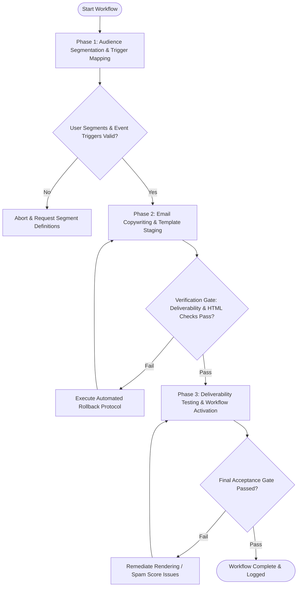

# Workflow: Automated Email Drip Sequence & Lifecycle Nurturing

## Overview & Scope
The Email Drip Sequence workflow creates lifecycle email automation campaigns. It designs onboarding welcome drips, behavioral re-engagement triggers, trial-to-paid conversion sequences, and churn prevention playbooks while enforcing deliverability and compliance standards.

## Execution Flowchart

## Required Tool Inputs & Context
- Lifecycle stage definitions (New User, Active Free, Trial Expiring, Inactive At-Risk, Churned)
- Behavioral event triggers (User Signed Up, Feature Unused after 7 Days, Trial Day 11, Churn Risk Score > 70)
- Responsive email HTML templates and merge tag syntax specification
- Deliverability configuration (SPF, DKIM, DMARC, List-Unsubscribe headers)

## Phase 1: Audience Segmentation & Trigger Mapping
- Map lifecycle trigger rules and delay cadences (Day 0: Welcome, Day 2: Key Feature Tutorial, Day 5: Case Study, Day 10: Upgrade Offer).
- Define audience inclusion and exclusion filters (e.g., exclude paying customers from upgrade drips).
- Configure frequency capping rules to prevent subscriber email fatigue.
- Set primary conversion goals per sequence (Activation, Upgrade, Feature Adoption, Re-activation).

## Phase 2: Email Copywriting & Template Staging
- Draft compelling subject lines, preview text, and body copy using proven copywriting frameworks (PAS, AIDA).
- Build responsive HTML/CSS email templates with dynamic merge tags (`first_name`, `company_name`, `usage_stat`).
- Implement plain-text email fallbacks and one-click unsubscribe links compliant with CAN-SPAM and GDPR.
- Configure A/B split testing for subject lines and CTA button copy.

## Phase 3: Deliverability Testing & Workflow Activation
- Audit authentication records (SPF, DKIM, DMARC) and run automated spam score analysis (SpamAssassin score < 2.0).
- Perform cross-client rendering test across mobile, desktop, web clients, and Dark Mode.
- Verify webhook bounce handling and unsubscribe event processing.
- Deploy automated drip sequences into live marketing automation engine.

## Phase Transition Criteria & Deterministic Verification Gates
| Transition | Prerequisites | Verification Command / Gate | Success Criteria |
|---|---|---|---|
| Phase 1 -> Phase 2 | Tool inputs verified & environment ready | `node dist/cli.js doctor` | Doctor health check succeeds with 0 errors |
| Phase 2 -> Phase 3 | Execution steps complete | `npm test` | Email template validator confirms responsive HTML layout, merge tag syntax, and link tracking |
| Phase 3 -> Completion | Verification complete & artifacts signed off | `npm run build` | Automation sequence configuration and email templates compile without errors |

## Validation Checkpoints & Automated Rollback Protocols
- **Validation Checkpoint 1**: Email spam test produces zero deliverability warnings and passes SPF/DKIM verification.
- **Validation Checkpoint 2**: HTML templates render correctly across 100% of tested client configurations including dark mode.
- **Validation Checkpoint 3**: Unsubscribe links and physical mailing address headers are present in all message templates.
- **Automated Rollback Protocol**: Immediately pause active drip automation and suppress affected recipient segments if bounce rate exceeds 2.5% or spam complaint rate exceeds 0.08% during initial sequence sends.
