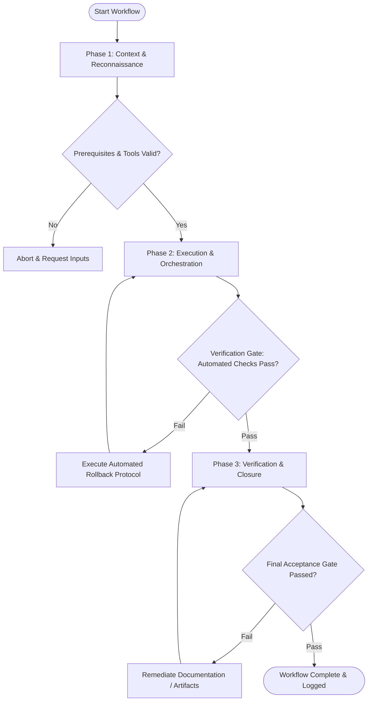

# Workflow: Architectural Explanation & Technical Walkthrough

## Overview & Scope
The Explain workflow creates clear technical explanations. It structures walkthroughs using progressive disclosure (High-level summary -> Diagram -> Code inspection -> Edge cases) tailored to audience experience.

## Execution Flowchart

## Required Tool Inputs & Context
- Target codebase files or technical concept
- Target audience experience profile (Beginner, Intermediate, Senior Engineer)
- Explanation document template

## Phase 1: Context & Reconnaissance
- Analyze target code module to understand core mechanisms and data flows.
- Identify key concepts requiring explanation and potential points of confusion.
- Determine appropriate depth level based on audience profile.

## Phase 2: Execution & Orchestration
- Construct high-level summary overview of the component or architecture.
- Draw system interaction diagram illustrating data flow between modules.
- Provide step-by-step code walkthrough with line-by-line commentary.

## Phase 3: Verification & Closure
- Review explanation for clarity, technical accuracy, and tone.
- Add FAQ section covering common edge cases and troubleshooting tips.
- Publish Technical Explanation Document.

## Phase Transition Criteria & Deterministic Verification Gates
| Transition | Prerequisites | Verification Command / Gate | Success Criteria |
|---|---|---|---|
| Phase 1 -> Phase 2 | Tool inputs verified & environment ready | `node dist/cli.js doctor` | Doctor health check succeeds with 0 errors |
| Phase 2 -> Phase 3 | Execution steps complete | `node dist/cli.js doctor` | Doctor health check confirms explanation document structure |
| Phase 3 -> Completion | Verification complete & artifacts signed off | `npm run typecheck` | Code snippets inside explanation compile cleanly |

## Validation Checkpoints & Automated Rollback Protocols
- **Validation Checkpoint 1**: Explanation tailored appropriately to target audience technical level.
- **Validation Checkpoint 2**: Code commentary verified against actual implementation logic.
- **Automated Rollback Protocol**: Clarify ambiguous sections if peer review identifies inaccurate commentary.
