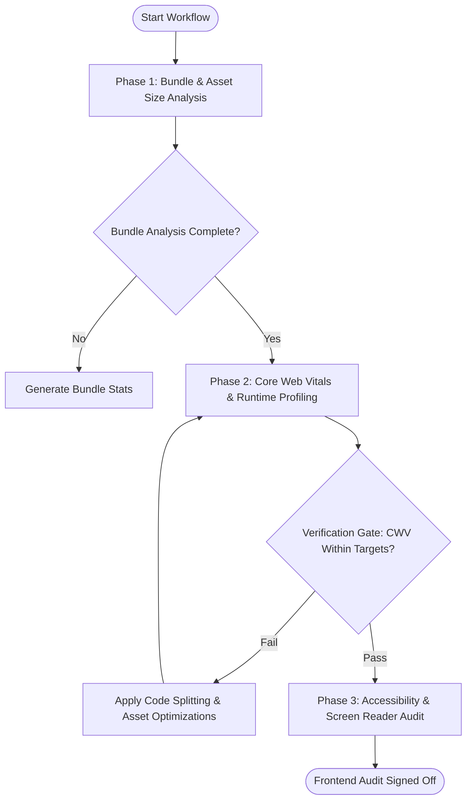

# Workflow: Frontend Performance & Accessibility Audit

## Overview & Scope
The Frontend Audit workflow evaluates web applications against Core Web Vitals thresholds (Largest Contentful Paint, Interaction to Next Paint, Cumulative Layout Shift), accessibility standards, and JavaScript bundle sizes.

## Execution Flowchart

## Required Tool Inputs & Context
- Production build bundle stats or Lighthouse test runner
- Target performance budgets (e.g. initial JS < 150KB gzip)
- Web application URL or local preview server

## Phase 1: Bundle & Asset Size Analysis
- Analyze Webpack / Vite / Next.js bundle visualizer output.
- Identify duplicate dependencies or un-tree-shaken libraries.

## Phase 2: Core Web Vitals & Runtime Profiling
- Measure Largest Contentful Paint (LCP < 2.5s), Cumulative Layout Shift (CLS < 0.1), and Interaction to Next Paint (INP < 200ms).
- Apply lazy loading, dynamic imports, and font optimization.

## Phase 3: Accessibility & Screen Reader Audit
- Run automated axe-core / Lighthouse a11y audit to verify WCAG 2.1 AA compliance.
- Confirm keyboard tab navigation and modal focus trapping.

## Phase Transition Criteria & Deterministic Verification Gates
| Transition | Prerequisites | Verification Command / Gate | Success Criteria |
|---|---|---|---|
| Phase 1 -> Phase 2 | Bundle analysis complete | Bundle size measurement | Main bundle under 150KB gzipped |
| Phase 2 -> Phase 3 | Performance metrics gathered | Lighthouse / Web Vitals audit | Performance score >= 90 |
| Phase 3 -> Completion | Accessibility verified | A11y axe-core scan | 0 critical/serious accessibility violations |
