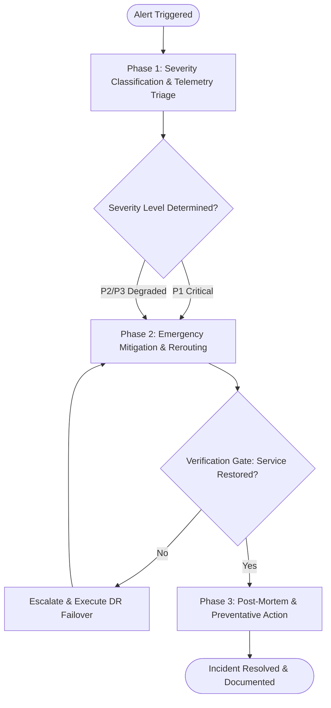

# Workflow: Production Incident Response & Triage

## Overview & Scope
The Incident Response workflow guides SRE and SysOps engineers through structured triage, root-cause investigation, emergency mitigation, and post-mortem reporting during production incidents.

## Execution Flowchart

## Required Tool Inputs & Context
- Triggering alert payload or error metric log trace
- System architecture diagram and service dependencies
- Prometheus / Grafana telemetry metrics and incident runbook

## Phase 1: Severity Classification & Telemetry Triage
- Correlate triggering alert with RED metrics (Rate, Errors, Duration).
- Classify incident severity (P1 Critical Outage, P2 High Impact, P3 Moderate Degraded State).

## Phase 2: Emergency Mitigation & Rerouting
- Execute runbook mitigation steps (pod scaling, traffic drain, service restart, cache flush).
- Monitor p99 latency and error rates to confirm service stabilization.

## Phase 3: Post-Mortem & Preventative Action
- Draft Blameless Post-Mortem covering timeline, root cause, impact metrics, and action items.
- File preventative engineering tickets to prevent incident recurrence.

## Phase Transition Criteria & Deterministic Verification Gates
| Transition | Prerequisites | Verification Command / Gate | Success Criteria |
|---|---|---|---|
| Phase 1 -> Phase 2 | Incident severity classified | Log analysis & alert payload audit | Impacted microservices identified |
| Phase 2 -> Phase 3 | Mitigation steps applied | Telemetry HTTP 5xx error rate audit | Error rate drops below 0.1% SLO threshold |
| Phase 3 -> Completion | Service health verified | Post-mortem markdown audit | Post-mortem document includes action items and owner assignments |
