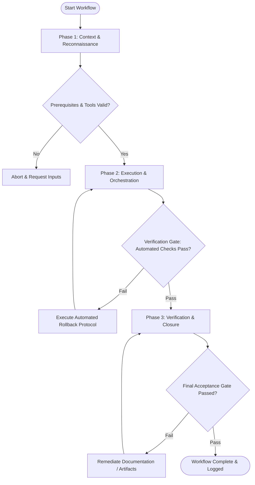

# Workflow: Micro-Interaction & Transition Design

## Overview & Scope
This workflow defines micro-interactions and UI motion specs. It standardizes transition durations, easing curves, visual feedback states, and accessibility fallbacks for motion sensitivities.

## Execution Flowchart

## Required Tool Inputs & Context
- UI component visual designs
- Design system motion guidelines (durations, easing curves)
- Accessibility reduced motion specification (`prefers-reduced-motion`)

## Phase 1: Context & Reconnaissance
- Identify interactive UI triggers (hover, active press, toggle, modal open, page transition).
- Review target motion principles (expressive vs functional animation).
- Establish duration thresholds (150ms micro-interactions, 300ms layout transitions).

## Phase 2: Execution & Orchestration
- Define animation properties (scale, opacity, transform, background-color).
- Select cubic-bezier easing curves (ease-in-out, standard spring curves).
- Design reduced-motion alternatives for users with motion sensitivity settings.

## Phase 3: Verification & Closure
- Verify motion performance (60fps hardware acceleration, GPU-promoted layers).
- Document interaction spec with timing values and CSS/Framer Motion code snippets.
- Export interaction tokens (`duration-fast`, `ease-out-back`).

## Phase Transition Criteria & Deterministic Verification Gates
| Transition | Prerequisites | Verification Command / Gate | Success Criteria |
|---|---|---|---|
| Phase 1 -> Phase 2 | Tool inputs verified & environment ready | `node dist/cli.js doctor` | Doctor health check succeeds with 0 errors |
| Phase 2 -> Phase 3 | Execution steps complete | `npm test` | Interaction suite verifies prefers-reduced-motion fallbacks for all motion specs |
| Phase 3 -> Completion | Verification complete & artifacts signed off | `npm run build` | Motion animation CSS/JS tokens build cleanly |

## Validation Checkpoints & Automated Rollback Protocols
- **Validation Checkpoint 1**: All transition durations fall within standard 100ms-300ms usability window.
- **Validation Checkpoint 2**: Explicit reduced-motion fallback defined for every animated component.
- **Automated Rollback Protocol**: Simplify animation curves and remove heavy transforms if frame rate drops below 60fps.
