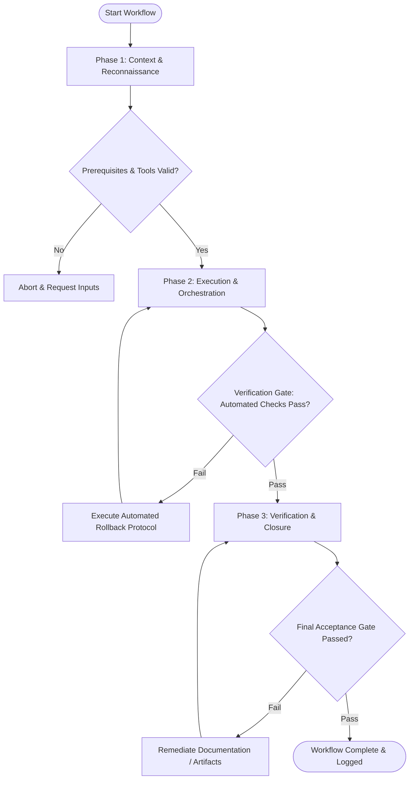

# Workflow: Error UX & Fault Recovery Flow Design

## Overview & Scope
The Error Flow workflow ensures resilient UI design during system failures. It maps validation errors, network offline states, API exceptions, and user recovery mechanisms with clear human-centric UX.

## Execution Flowchart

## Required Tool Inputs & Context
- User interaction flows & form specifications
- API error payload schemas and HTTP status codes
- Error copy guidelines

## Phase 1: Context & Reconnaissance
- Enumerate all potential failure modes (field validation failure, session timeout, network offline, 500 server error).
- Audit existing error message copy for clarity and tone.
- Define focus management strategy when error state triggers.

## Phase 2: Execution & Orchestration
- Design inline error messages, toast alerts, empty state illustrations, and modal error dialogs.
- Map explicit recovery paths for the user (Retry CTA, Re-authenticate link, Customer support fallback).
- Draft clear, empathetic error copy explaining what happened and how to fix it.

## Phase 3: Verification & Closure
- Review error flows against accessibility guidelines (ARIA live regions `aria-live="polite"`).
- Verify focus is placed on broken form inputs or alert headers upon error submission.
- Publish Error UX Specification Matrix.

## Phase Transition Criteria & Deterministic Verification Gates
| Transition | Prerequisites | Verification Command / Gate | Success Criteria |
|---|---|---|---|
| Phase 1 -> Phase 2 | Tool inputs verified & environment ready | `node dist/cli.js doctor` | Doctor health check succeeds with 0 errors |
| Phase 2 -> Phase 3 | Execution steps complete | `npm test` | Error flow tests verify accessibility ARIA live attributes on error containers |
| Phase 3 -> Completion | Verification complete & artifacts signed off | `npm run typecheck` | Error payload interfaces compile cleanly |

## Validation Checkpoints & Automated Rollback Protocols
- **Validation Checkpoint 1**: Every failure mode has an explicit UI design and recovery CTA.
- **Validation Checkpoint 2**: Zero technical error jargon in user-facing message copy.
- **Automated Rollback Protocol**: Revise error messages and recovery paths if usability checks reveal confusing copy.
