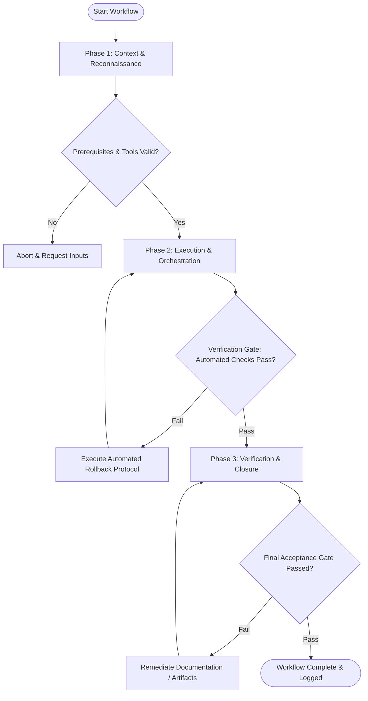

# Workflow: Component State Matrix Mapping

## Overview & Scope
This workflow guarantees complete UI component state coverage. It maps the 7 fundamental component states, ensuring consistent visual and keyboard behavior across the application.

## Execution Flowchart

## Required Tool Inputs & Context
- Component visual designs & design tokens
- Accessibility focus ring guidelines (contrast >= 3:1)
- Component state checklist

## Phase 1: Context & Reconnaissance
- List target components requiring state mapping (buttons, text inputs, checkboxes, dropdowns, toggles).
- Identify visual property changes for each state transition (background, border, shadow, opacity).
- Verify keyboard focus styling rules.

## Phase 2: Execution & Orchestration
- Document visual design specs for all 7 standard states: Default, Hover, Focus-Visible, Active (Pressed), Disabled, Loading, Error.
- Define state transition rules and visual indicators (spinner for loading, greyed out for disabled).
- Verify focus ring meets WCAG 2.1 visible focus requirements.

## Phase 3: Verification & Closure
- Audit component state matrix for missing state specs.
- Export state matrix specifications to design system component docs.
- Publish Component State Checklist.

## Phase Transition Criteria & Deterministic Verification Gates
| Transition | Prerequisites | Verification Command / Gate | Success Criteria |
|---|---|---|---|
| Phase 1 -> Phase 2 | Tool inputs verified & environment ready | `node dist/cli.js doctor` | Doctor health check succeeds with 0 errors |
| Phase 2 -> Phase 3 | Execution steps complete | `npm test` | State matrix test verifies 100% state coverage for all cataloged components |
| Phase 3 -> Completion | Verification complete & artifacts signed off | `npm run build` | Component CSS state classes build without compilation errors |

## Validation Checkpoints & Automated Rollback Protocols
- **Validation Checkpoint 1**: All 7 component states explicitly specified for every cataloged component.
- **Validation Checkpoint 2**: Focus-visible state ring has >= 3:1 contrast ratio against adjacent surfaces.
- **Automated Rollback Protocol**: Add missing state specifications before releasing component to component library.
