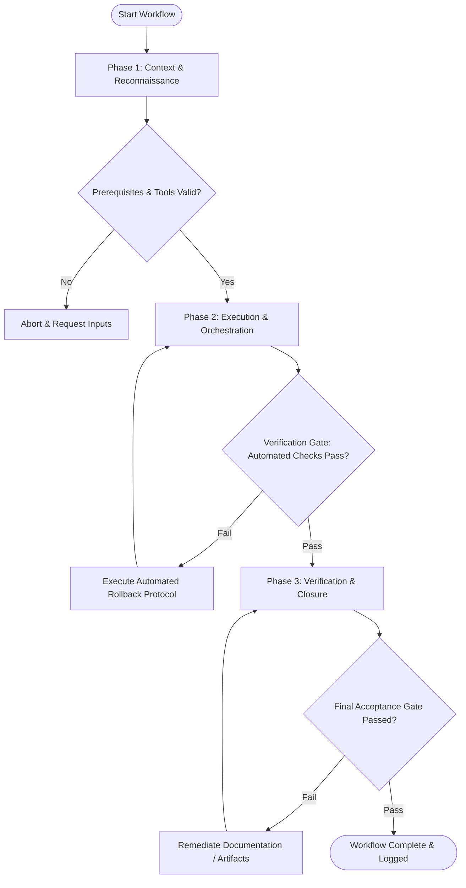

# Workflow: Growth & Marketing Funnel Audit

## Overview & Scope
This workflow conducts end-to-end marketing audits. It inspects acquisition channels, conversion funnel drop-off metrics, landing page technical SEO, page speed, and analytics event tracking.

## Execution Flowchart

## Required Tool Inputs & Context
- Analytics dataset exports (funnel drop-offs, conversion rates)
- Landing page URLs & technical SEO audit tools
- Target funnel stage definitions

## Phase 1: Context & Reconnaissance
- Map full user acquisition funnel (Traffic -> Landing Page -> Signup -> Activation -> Paid Conversion).
- Extract analytics drop-off metrics across each funnel transition step.
- Prepare technical SEO and landing page speed scanner tools.

## Phase 2: Execution & Orchestration
- Identify high-drop-off funnel bottlenecks and conversion friction points.
- Audit landing page technical SEO (meta tags, open graph, structured schema) and Core Web Vitals.
- Inspect analytics event tracking setup to verify accuracy of conversion logging.

## Phase 3: Verification & Closure
- Synthesize audit findings into an Impact vs Effort Growth Opportunity Matrix.
- Create prioritized remediation backlog targeting high-leverage conversion fixes.
- Publish Growth & Marketing Funnel Audit Report.

## Phase Transition Criteria & Deterministic Verification Gates
| Transition | Prerequisites | Verification Command / Gate | Success Criteria |
|---|---|---|---|
| Phase 1 -> Phase 2 | Tool inputs verified & environment ready | `node dist/cli.js doctor` | Doctor health check succeeds with 0 errors |
| Phase 2 -> Phase 3 | Execution steps complete | `npm test` | Funnel analytics script verifies data consistency across conversion stages |
| Phase 3 -> Completion | Verification complete & artifacts signed off | `npm run build` | Build pipeline validates audit report compilation |

## Validation Checkpoints & Automated Rollback Protocols
- **Validation Checkpoint 1**: All acquisition funnel drop-off points quantified with analytics baseline data.
- **Validation Checkpoint 2**: Technical SEO issues cataloged with actionable remediation fixes.
- **Automated Rollback Protocol**: Re-verify analytics tracking tags if data anomalies pollute funnel audit calculations.
