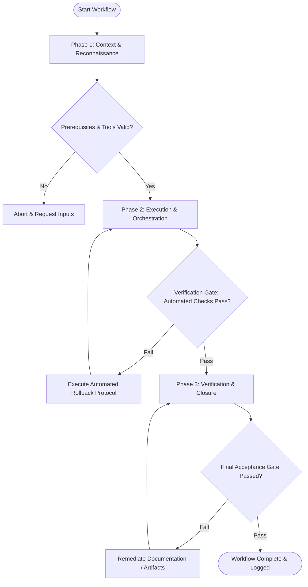

# Workflow: Multi-Channel Marketing Campaign Construction

## Overview & Scope
The Campaign Builder workflow constructs integrated multi-channel marketing campaigns. It orchestrates landing page creation, email drip sequences, ad creative assets, and UTM tracking parameters.

## Execution Flowchart

## Required Tool Inputs & Context
- Marketing campaign brief & strategy roadmap
- Channel creative templates (email HTML, ad banners, social posts)
- UTM parameter taxonomy guidelines

## Phase 1: Context & Reconnaissance
- Establish campaign goals (lead generation, feature announcement, webinar signups).
- Define target channels (Email, Twitter/X, LinkedIn, Google Ads, Meta Ads).
- Confirm campaign budget, schedule, and UTM tracking structure.

## Phase 2: Execution & Orchestration
- Draft campaign landing page copy and configure opt-in form integration.
- Write multi-step email nurture sequence (Welcome, Value delivery, Social proof, Offer CTA).
- Generate ad banner visual assets and social media post copy variations with UTM links.

## Phase 3: Verification & Closure
- Test campaign links in analytics sandbox to verify UTM parameter tracking.
- Preview email rendering across email clients (mobile, desktop, dark mode).
- Publish Campaign Execution Blueprint.

## Phase Transition Criteria & Deterministic Verification Gates
| Transition | Prerequisites | Verification Command / Gate | Success Criteria |
|---|---|---|---|
| Phase 1 -> Phase 2 | Tool inputs verified & environment ready | `node dist/cli.js doctor` | Doctor health check succeeds with 0 errors |
| Phase 2 -> Phase 3 | Execution steps complete | `npm test` | UTM link validator verifies 100% of campaign links contain correct tracking parameters |
| Phase 3 -> Completion | Verification complete & artifacts signed off | `npm run build` | Email HTML templates and campaign assets build without errors |

## Validation Checkpoints & Automated Rollback Protocols
- **Validation Checkpoint 1**: All UTM tracking parameters configured and verified in analytics test environment.
- **Validation Checkpoint 2**: Campaign copy matches approved brand messaging brief across all channels.
- **Automated Rollback Protocol**: Pause campaign rollout if link tracking parameters fail to log in analytics test sandbox.
