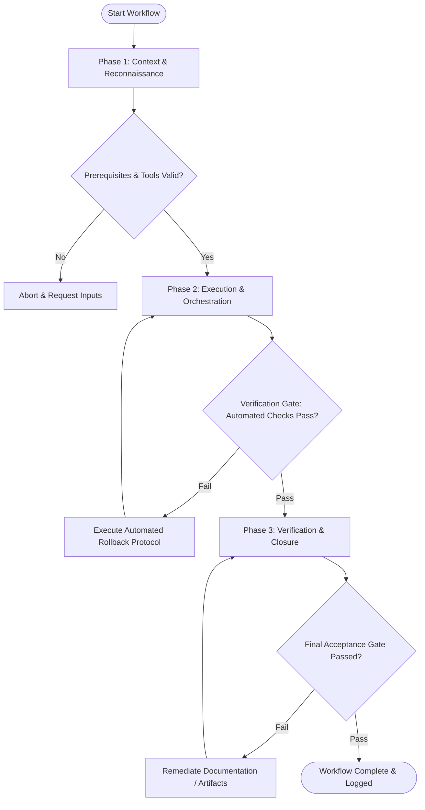

# Workflow: Content Engine & SEO Pipeline

## Overview & Scope
This workflow drives the content engine. It structures keyword research, topic clustering, SEO-optimized article drafting, Schema.org markup validation, and CMS publishing.

## Execution Flowchart

## Required Tool Inputs & Context
- Target search query keyword research data
- Editorial style guide and content guidelines
- SEO optimization scanner & Schema.org validator

## Phase 1: Context & Reconnaissance
- Identify target search queries, search intent, and top-ranking competitor content.
- Develop article outline featuring target primary keyword and supporting LSI keywords.
- Select Schema.org structured data type (Article, BlogPosting, HowTo).

## Phase 2: Execution & Orchestration
- Draft comprehensive content article addressing search intent with depth and clarity.
- Incorporate internal links to related product pages and authoritative external sources.
- Write optimized title tag, meta description, H1/H2 headings, and image alt text.

## Phase 3: Verification & Closure
- Perform readability check (Flesch-Kincaid score) and verify keyword density (1-2%).
- Validate Schema.org JSON-LD structured data using rich result validator tools.
- Publish article to CMS repository.

## Phase Transition Criteria & Deterministic Verification Gates
| Transition | Prerequisites | Verification Command / Gate | Success Criteria |
|---|---|---|---|
| Phase 1 -> Phase 2 | Tool inputs verified & environment ready | `node dist/cli.js doctor` | Doctor health check succeeds with 0 errors |
| Phase 2 -> Phase 3 | Execution steps complete | `npm test` | SEO content test suite validates Schema.org JSON-LD syntax |
| Phase 3 -> Completion | Verification complete & artifacts signed off | `npm run build` | CMS static site generator builds page cleanly |

## Validation Checkpoints & Automated Rollback Protocols
- **Validation Checkpoint 1**: Article satisfies word count and keyword intent coverage requirements.
- **Validation Checkpoint 2**: Schema.org structured data passes validation test with zero errors.
- **Automated Rollback Protocol**: Re-draft article sections if readability grade level falls outside target parameters.
