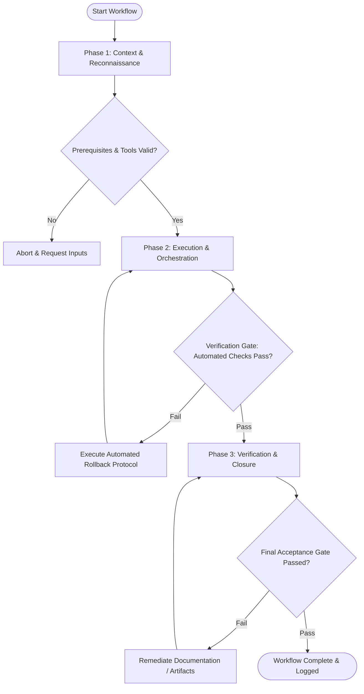

# Workflow: A/B Growth Experiment Design & Tracking

## Overview & Scope
The Growth Experiment workflow structures scientific A/B testing. It defines hypotheses, designs control and challenger variants, configures event tracking, and calculates statistical significance.

## Execution Flowchart

## Required Tool Inputs & Context
- Growth hypothesis statement
- A/B testing framework / feature flag system (PostHog / LaunchDarkly)
- Baseline metric conversion rates

## Phase 1: Context & Reconnaissance
- Formulate experiment hypothesis: "If [change], then [impact] because [rationale]".
- Calculate required sample size and test duration for 95% statistical power.
- Define primary conversion metric and secondary guardrail metrics.

## Phase 2: Execution & Orchestration
- Configure Variant A (Control) and Variant B (Challenger) in experiment platform.
- Implement analytics event tracking triggers for conversion actions.
- Run sample ratio mismatch (SRM) test to verify unbiased 50/50 traffic split.

## Phase 3: Verification & Closure
- Monitor experiment health during initial traffic rollout.
- Evaluate conversion results once required sample size is reached, calculating p-value.
- Publish Growth Experiment Results & Learnings report.

## Phase Transition Criteria & Deterministic Verification Gates
| Transition | Prerequisites | Verification Command / Gate | Success Criteria |
|---|---|---|---|
| Phase 1 -> Phase 2 | Tool inputs verified & environment ready | `node dist/cli.js doctor` | Doctor health check succeeds with 0 errors |
| Phase 2 -> Phase 3 | Execution steps complete | `npm test` | Experiment tracking suite validates event logging for both variants |
| Phase 3 -> Completion | Verification complete & artifacts signed off | `npm run build` | Experiment feature flag code builds without type errors |

## Validation Checkpoints & Automated Rollback Protocols
- **Validation Checkpoint 1**: Sample ratio mismatch (SRM) test confirms unbiased traffic allocation.
- **Validation Checkpoint 2**: Statistical significance reaches >= 95% confidence before declaring winning variant.
- **Automated Rollback Protocol**: Disable challenger experiment variant immediately if conversion drops severely during rollout.
