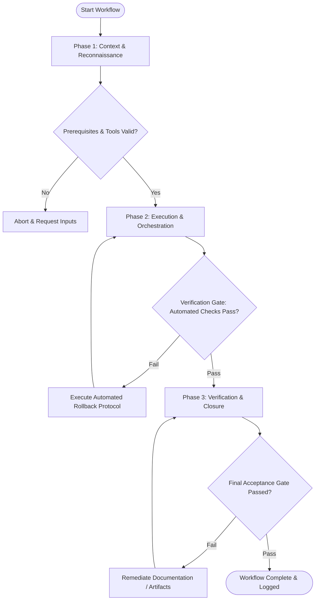

# Workflow: Marketing & Messaging Review Panel

## Overview & Scope
The Marketing Panel workflow evaluates campaign messaging and positioning. It convenes Growth Strategists, Copywriters, and Conversion Specialists to review value propositions, CTA clarity, and brand voice.

## Execution Flowchart

## Required Tool Inputs & Context
- Marketing campaign brief & copy drafts
- Value proposition canvas and target audience personas
- Brand positioning guidelines

## Phase 1: Context & Reconnaissance
- Gather marketing assets, landing page copy, email drafts, and ad creative.
- Define evaluation dimensions (Value messaging clarity, Emotional resonance, Call-to-action strength, Brand tone).
- Distribute copy drafts to marketing panel personas.

## Phase 2: Execution & Orchestration
- Conduct panel review session collecting structured feedback across marketing specialist roles.
- Audit copy for jargon, ambiguous claims, and value clarity above the page fold.
- Identify positioning friction and formulate copy optimization suggestions.

## Phase 3: Verification & Closure
- Synthesize panel feedback into Marketing Review Verdict (Approved, Approved with Copy Edits, Rejected).
- Draft actionable copy revision guide with line-by-line recommendations.
- Publish Marketing Panel Review Summary.

## Phase Transition Criteria & Deterministic Verification Gates
| Transition | Prerequisites | Verification Command / Gate | Success Criteria |
|---|---|---|---|
| Phase 1 -> Phase 2 | Tool inputs verified & environment ready | `node dist/cli.js doctor` | Doctor health check succeeds with 0 errors |
| Phase 2 -> Phase 3 | Execution steps complete | `node dist/cli.js doctor` | Doctor health check confirms marketing panel report format |
| Phase 3 -> Completion | Verification complete & artifacts signed off | `npm test` | Validation tests pass for copy audit report artifacts |

## Validation Checkpoints & Automated Rollback Protocols
- **Validation Checkpoint 1**: Core value proposition clearly communicated within first fold screen area.
- **Validation Checkpoint 2**: Zero confusing jargon or unsubstantiated claims in hero section copy.
- **Automated Rollback Protocol**: Reject campaign copy for re-write if message clarity score falls below evaluation threshold.
