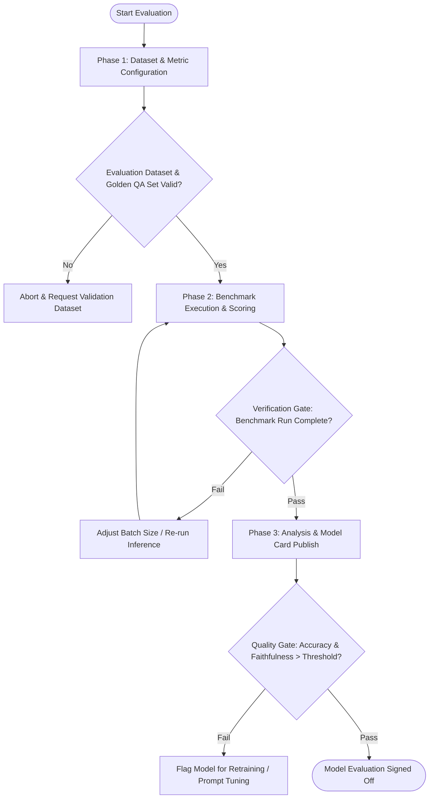

# Workflow: ML Model Evaluation & Benchmarking

## Overview & Scope
This workflow coordinates systematic evaluation of fine-tuned and open-source models against standardized benchmark datasets, measuring faithfulness, context relevancy, and inference latency.

## Execution Flowchart

## Phase 1: Dataset & Metric Configuration
- Load golden QA evaluation splits or standardized benchmarks (MMLU, GSM8k, Ragas synthetic testsets).
- Define evaluation thresholds (e.g. Faithfulness >= 0.85, Answer Relevance >= 0.80).

## Phase 2: Benchmark Execution & Scoring
- Execute deterministic batch inference across evaluation splits with fixed random seeds.
- Compute automated metrics (Exact Match, BLEU/ROUGE, Ragas LLM-as-a-judge scores).

## Phase 3: Analysis & Model Card Publish
- Analyze error distribution and hallucination clusters.
- Generate Hugging Face model evaluation scorecard and publish metrics summary.

## Phase Transition Criteria & Deterministic Verification Gates
| Transition | Prerequisites | Verification Command / Gate | Success Criteria |
|---|---|---|---|
| Phase 1 -> Phase 2 | Datasets validated | `node dist/cli.js doctor` | Evaluation harness initialized |
| Phase 2 -> Phase 3 | Scoring complete | `npm test` | Benchmark outputs parsed into structured metrics |
| Phase 3 -> Completion | Metrics meet quality bar | `node dist/cli.js doctor` | Scorecard published and verified |

## Validation Checkpoints & Automated Rollback Protocols
- **Validation Checkpoint 1**: Verify dataset schema compliance and label distributions before starting benchmark run.
- **Validation Checkpoint 2**: Ensure deterministic seed produces identical predictions on sample batch.
- **Automated Rollback Protocol**: If evaluation reveals critical toxicity regression or accuracy drop > 5%, revert model deployment target to previous checkpoint baseline and emit alert.
