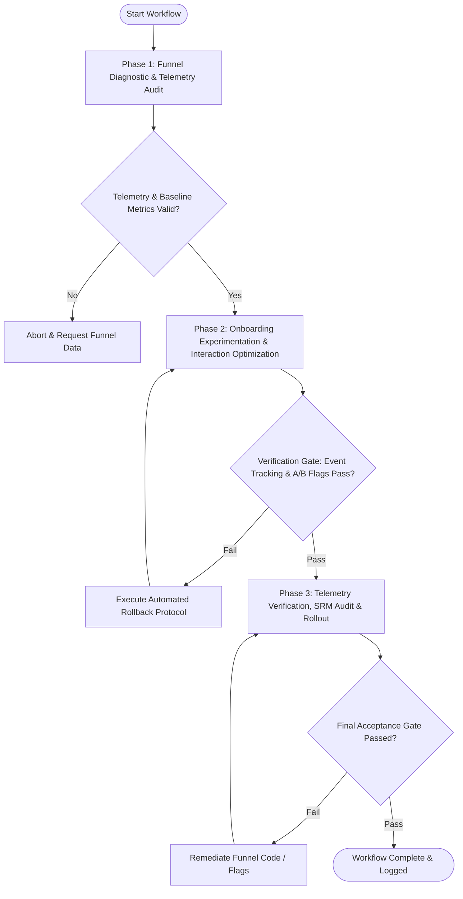

# Workflow: Product-Led Onboarding Funnel & Conversion Rate Optimization

## Overview & Scope
The Onboarding Funnel CRO workflow accelerates user activation and Product-Led Growth (PLG). It conducts funnel drop-off diagnostics, form friction reduction, interactive onboarding checklist deployment, time-to-value (TTV) optimization, and viral referral loop engineering.

## Execution Flowchart

## Required Tool Inputs & Context
- Onboarding funnel step definitions (Signup -> Profile -> First Project -> Aha Moment -> Activation)
- Baseline conversion telemetry (step-by-step drop-off rates, time-to-value benchmarks)
- Feature flag / experimentation platform configuration (PostHog, LaunchDarkly, GrowthBook)
- Product onboarding UI component library (checklists, tooltips, empty states)

## Phase 1: Funnel Diagnostic & Telemetry Audit
- Map user journey milestones from initial landing to core product activation.
- Analyze step-by-step drop-off metrics to identify primary conversion bottlenecks.
- Calculate baseline Time-to-Value (TTV) and identify friction points (unnecessary form fields, password friction, premature paywalls).
- Formulate CRO hypothesis: "By replacing [friction point] with [optimized interaction], activation rate will increase by [X]%".

## Phase 2: Onboarding Experimentation & Interaction Optimization
- Design optimized challenger variant (frictionless OAuth/magic link, progressive profiling, interactive onboarding checklist).
- Pre-fill empty states with actionable starter templates to accelerate the "Aha!" moment.
- Integrate viral referral mechanics (team invite prompts, shared workspace links, gamified completion rewards).
- Configure A/B test feature flags with deterministic 50/50 user hashing.

## Phase 3: Telemetry Verification, SRM Audit & Rollout
- Verify analytics event emission across all onboarding milestone steps.
- Execute Sample Ratio Mismatch (SRM) test to confirm unbiased 50/50 traffic split between control and challenger variants.
- Monitor error logs, user drop-offs, and completion rates in real time during initial rollout.
- Evaluate statistical significance (p < 0.05) once required sample size is reached.

## Phase Transition Criteria & Deterministic Verification Gates
| Transition | Prerequisites | Verification Command / Gate | Success Criteria |
|---|---|---|---|
| Phase 1 -> Phase 2 | Tool inputs verified & environment ready | `node dist/cli.js doctor` | Doctor health check succeeds with 0 errors |
| Phase 2 -> Phase 3 | Execution steps complete | `npm test` | Onboarding test suite validates event tracking triggers and feature flag routing logic |
| Phase 3 -> Completion | Verification complete & artifacts signed off | `npm run build` | Frontend UI components and onboarding bundle compile without TypeScript errors |

## Validation Checkpoints & Automated Rollback Protocols
- **Validation Checkpoint 1**: All onboarding milestone events fire consistently with valid user and workspace IDs.
- **Validation Checkpoint 2**: Sample Ratio Mismatch (SRM) chi-square test passes with p > 0.01, confirming unskewed variant distribution.
- **Validation Checkpoint 3**: Challenger variant demonstrates zero regression in critical registration flows.
- **Automated Rollback Protocol**: Automatically switch feature flag to 100% control variant and disable challenger flow if onboarding error rate spikes by > 2% or completion rate drops significantly during rollout.
