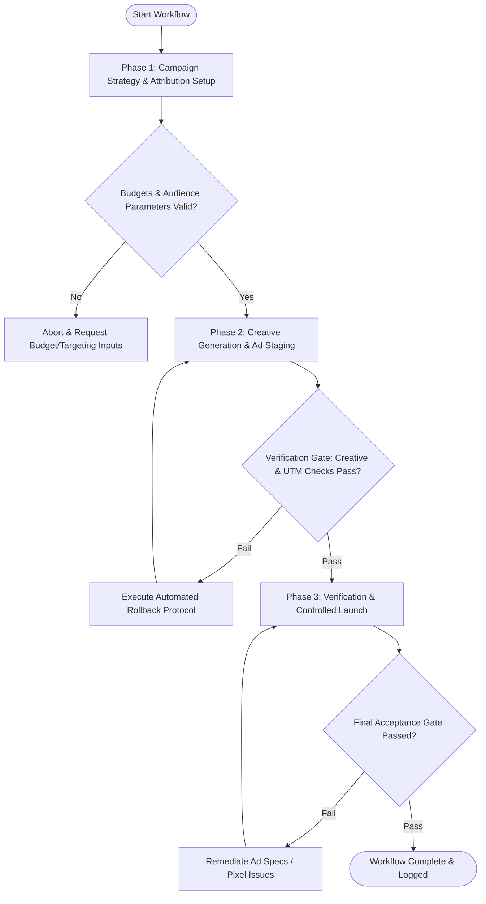

# Workflow: Multi-Channel Paid Acquisition Campaign Management

## Overview & Scope
The Paid Acquisition Campaign workflow structures end-to-end PPC campaign deployment across Google Ads, Meta Ads, and LinkedIn Ads. It covers audience targeting, ad copy matrix generation, creative aspect-ratio staging, UTM parameter taxonomy enforcement, and multi-touch attribution modeling.

## Execution Flowchart

## Required Tool Inputs & Context
- Campaign brief & target audience personas (interests, job titles, retargeting lists)
- Channel allocation and daily/monthly spend budget caps
- Creative assets (ad copy matrix, visual banners, video cuts)
- UTM taxonomy specification and attribution tracking endpoint

## Phase 1: Campaign Strategy & Attribution Setup
- Define campaign objective (Leads, Conversions, Brand Awareness) and channel distribution (Google Search/PMax, Meta, LinkedIn).
- Configure audience targeting rules: Custom Audiences, Lookalikes, keyword match types (Exact/Phrase), and negative keyword lists.
- Establish UTM parameter taxonomy (`utm_source`, `utm_medium`, `utm_campaign`, `utm_content`, `utm_term`).
- Verify conversion tracking pixels and server-side Conversions API (CAPI) endpoints.

## Phase 2: Creative Generation & Ad Staging
- Write multi-variant ad copy matrix (Headline variations, Primary text, Problem-Agitation, Social proof, CTA).
- Stage visual creative assets formatted for channel aspect ratios (1:1 Feed, 9:16 Stories/Reels, 16:9 Landscape).
- Verify landing page message match and conversion form functionality.
- Configure bid strategy (Target CPA, Target ROAS, Max Conversions with hard cost cap).

## Phase 3: Verification & Controlled Launch
- Validate tracking pixels in sandbox environment using Tag Assistant / Pixel Helper tools.
- Test all ad destination URLs to confirm UTM parameters log accurately in attribution backend.
- Enforce daily spend hard caps and automated pacing rules to prevent budget runaway.
- Execute canary launch with controlled initial spend (10-20% of daily budget) before full scale.

## Phase Transition Criteria & Deterministic Verification Gates
| Transition | Prerequisites | Verification Command / Gate | Success Criteria |
|---|---|---|---|
| Phase 1 -> Phase 2 | Tool inputs verified & environment ready | `node dist/cli.js doctor` | Doctor health check succeeds with 0 errors |
| Phase 2 -> Phase 3 | Execution steps complete | `npm test` | Ad asset validator confirms 100% adherence to character limits, aspect ratios, and UTM parameters |
| Phase 3 -> Completion | Verification complete & artifacts signed off | `npm run build` | Campaign launch manifest and tracking configuration compile cleanly |

## Validation Checkpoints & Automated Rollback Protocols
- **Validation Checkpoint 1**: 100% of destination URLs contain valid UTM parameters matching the attribution taxonomy.
- **Validation Checkpoint 2**: Ad creative dimensions and copy lengths comply with platform ad policies (Google, Meta, LinkedIn).
- **Validation Checkpoint 3**: Daily budget spend ceilings and automated pacing rules are active in ad accounts.
- **Automated Rollback Protocol**: Immediately trigger automated pause API calls on active ad sets and revert campaign status to DRAFT if conversion tracking fails to log in attribution telemetry or spend velocity exceeds 120% of hourly target without conversions.
