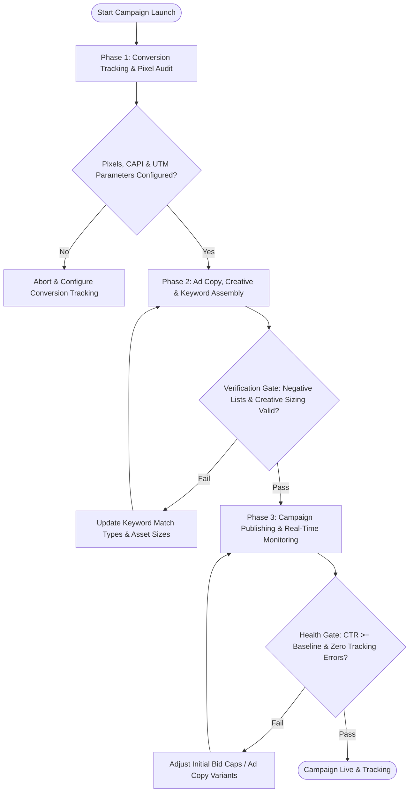

# Workflow: Paid Campaign Architecture & Launch

## Overview & Scope
This workflow orchestrates paid acquisition campaigns across Google Search, Meta Ads, and LinkedIn, ensuring proper conversion tracking, negative keyword lists, and creative variant testing.

## Execution Flowchart

## Phase 1: Conversion Tracking & Pixel Audit
- Verify Google Tag Manager / Meta Pixel / LinkedIn Insight Tag firing on conversion events.
- Test server-side Conversions API (CAPI) deduplication.

## Phase 2: Ad Copy, Creative & Keyword Assembly
- Group keywords into tightly themed ad sets and apply universal negative keyword lists.
- Stage 3-5 creative hook variants and responsive ad copy variations.

## Phase 3: Campaign Publishing & Real-Time Monitoring
- Publish campaigns with initial learning phase budget caps.
- Monitor search term reports for irrelevant query leakage and add negative keywords.

## Phase Transition Criteria & Deterministic Verification Gates
| Transition | Prerequisites | Verification Command / Gate | Success Criteria |
|---|---|---|---|
| Phase 1 -> Phase 2 | Tracking active | `node dist/cli.js doctor` | Conversion pixels and test events verified |
| Phase 2 -> Phase 3 | Assets assembled | `npm test` | All creative dimensions and copy lengths valid |
| Phase 3 -> Completion | Campaigns live | `node dist/cli.js doctor` | Impressions recording with verified attribution |
