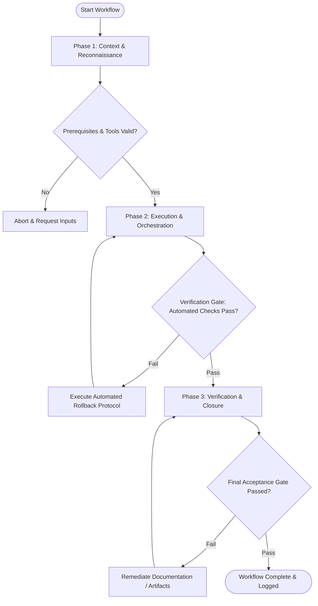

# Workflow: Architecture & Technical Planning

## Overview & Scope
The Plan workflow guides architects and senior engineers through drafting architecture decision records (ADRs), defining data models, outlining system boundaries, and establishing phased implementation roadmaps.

## Execution Flowchart

## Required Tool Inputs & Context
- Product requirements document (PRD) or feature specification
- Existing architectural diagrams & system boundaries
- Non-functional requirements (scalability, latency, security, budget)

## Phase 1: Context & Reconnaissance
- Gather and synthesize business requirements, system constraints, and non-functional goals.
- Audit existing system architecture to identify integration points, data dependencies, and technical debt.
- Define key architectural decisions requiring formal specification.

## Phase 2: Execution & Orchestration
- Draft Architecture Decision Record (ADR) detailing context, options considered, and chosen solution.
- Model data structures, API endpoints, component interfaces, and state transition flowcharts.
- Break down architecture implementation into sequential, verifiable milestone phases.

## Phase 3: Verification & Closure
- Conduct self-critique and peer architectural review against scalability, security, and maintainability criteria.
- Refine specification document, ensuring explicit failure modes and mitigation strategies are documented.
- Publish architecture plan artifact to project documentation repository.

## Phase Transition Criteria & Deterministic Verification Gates
| Transition | Prerequisites | Verification Command / Gate | Success Criteria |
|---|---|---|---|
| Phase 1 -> Phase 2 | Tool inputs verified & environment ready | `node dist/cli.js doctor` | Doctor health check succeeds with 0 errors |
| Phase 2 -> Phase 3 | Execution steps complete | `node dist/cli.js doctor` | System architecture plan schema and references pass health verification |
| Phase 3 -> Completion | Verification complete & artifacts signed off | `npm run typecheck` | Proposed data model types compile cleanly without type syntax errors |

## Validation Checkpoints & Automated Rollback Protocols
- **Validation Checkpoint 1**: All architectural decisions backed by explicit rationale and trade-off analysis.
- **Validation Checkpoint 2**: Data schemas fully specified with types, keys, and boundary conditions.
- **Automated Rollback Protocol**: Revert draft ADR document to revision state if architectural review uncovers unmitigated system bottlenecks.
