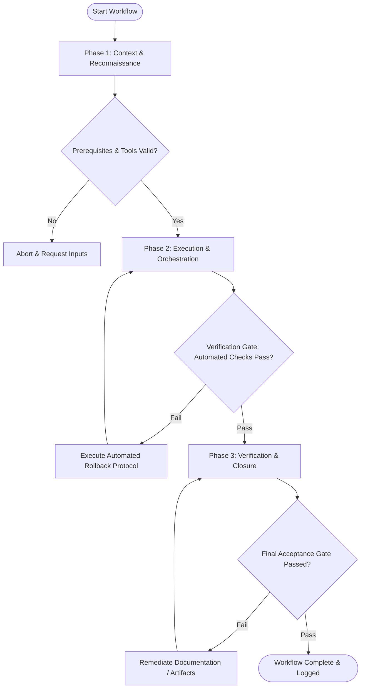

# Workflow: Prototype Usability Evaluation & Analytics

## Overview & Scope
This workflow standardizes usability test evaluation. It synthesizes qualitative user testing video recordings, quantifies task completion rates, scores System Usability Scale (SUS), and categorizes UX friction points.

## Execution Flowchart

## Required Tool Inputs & Context
- User test session video recordings & transcripts
- Task completion tracking sheets
- System Usability Scale (SUS) survey data

## Phase 1: Context & Reconnaissance
- Gather recorded usability test sessions and survey responses.
- Review usability evaluation targets (Task completion rate >= 80%, SUS score >= 75).
- Prepare observations coding sheet.

## Phase 2: Execution & Orchestration
- Analyze user session recordings, logging time-on-task, mis-clicks, and verbal feedback.
- Calculate quantitative usability metrics (Direct success, Indirect success, Failure rate, SUS score).
- Classify usability issues by severity (Critical blocker, Major friction, Minor enhancement).

## Phase 3: Verification & Closure
- Synthesize findings into Usability Evaluation Report with video evidence clips.
- Formulate prioritized remediation recommendations for product design iteration.
- Publish Usability Test Evaluation Summary.

## Phase Transition Criteria & Deterministic Verification Gates
| Transition | Prerequisites | Verification Command / Gate | Success Criteria |
|---|---|---|---|
| Phase 1 -> Phase 2 | Tool inputs verified & environment ready | `node dist/cli.js doctor` | Doctor health check succeeds with 0 errors |
| Phase 2 -> Phase 3 | Execution steps complete | `node dist/cli.js doctor` | Doctor health check confirms evaluation report schema validity |
| Phase 3 -> Completion | Verification complete & artifacts signed off | `npm test` | Usability metric calculation script validates data totals |

## Validation Checkpoints & Automated Rollback Protocols
- **Validation Checkpoint 1**: Usability issues categorized using standard 3-tier severity scale.
- **Validation Checkpoint 2**: Remediation recommendations backed directly by quantitative session data.
- **Automated Rollback Protocol**: Re-analyze session recordings if inter-evaluator agreement score falls below threshold.
