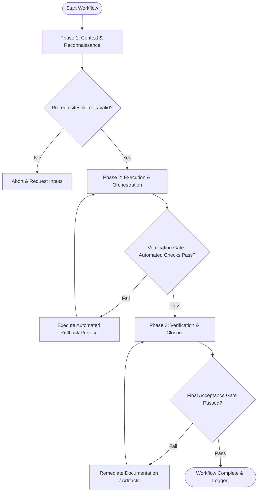

# Workflow: Rapid Prototyping Experimentation

## Overview & Scope
The Experiment workflow enables rapid hypothesis testing. It builds minimal, targeted experimental prototypes to validate specific interaction concepts or user flows prior to production coding.

## Execution Flowchart

## Required Tool Inputs & Context
- Target research hypothesis statement
- Rapid prototyping template library
- Interactive prototyping framework

## Phase 1: Context & Reconnaissance
- Define core test hypothesis (e.g. "Simplified 2-step checkout increases completion speed by 25%").
- Isolate key variables required to test hypothesis while stripping non-essential features.
- Select prototype fidelity level (low-fi wireframe vs mid-fi clickable).

## Phase 2: Execution & Orchestration
- Construct experimental prototype containing only essential UI pathways for hypothesis validation.
- Integrate simple analytics event logging to track user clicks and path navigation.
- Verify prototype interactive links function reliably.

## Phase 3: Verification & Closure
- Conduct internal dry-run walkthrough to verify test scenario flows.
- Deploy experiment prototype to staging environment for user testing.
- Document Experiment Setup Spec.

## Phase Transition Criteria & Deterministic Verification Gates
| Transition | Prerequisites | Verification Command / Gate | Success Criteria |
|---|---|---|---|
| Phase 1 -> Phase 2 | Tool inputs verified & environment ready | `node dist/cli.js doctor` | Doctor health check succeeds with 0 errors |
| Phase 2 -> Phase 3 | Execution steps complete | `npm test` | Prototype link verification test confirms 0 broken interactive pathways |
| Phase 3 -> Completion | Verification complete & artifacts signed off | `npm run build` | Prototype code compiles cleanly into preview build |

## Validation Checkpoints & Automated Rollback Protocols
- **Validation Checkpoint 1**: Prototype focuses strictly on testing target hypothesis without scope creep.
- **Validation Checkpoint 2**: All clickable pathways lead to valid response screens.
- **Automated Rollback Protocol**: Fix broken prototype links or interaction triggers before starting user sessions.
