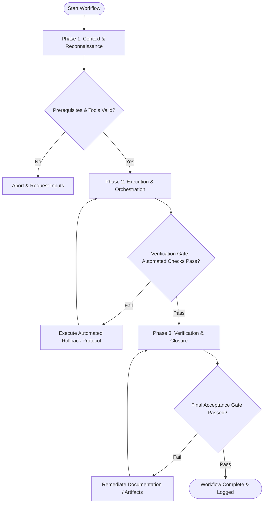

# Workflow: Interactive Prototype Architecture Plan

## Overview & Scope
This workflow plans prototype construction. It maps user flow branching, sets fidelity thresholds, defines state variables, and specifies mock data structures for prototype builds.

## Execution Flowchart

## Required Tool Inputs & Context
- User flow diagrams & feature requirements
- Target testing device specs (Desktop / Mobile)
- Mock data schema requirements

## Phase 1: Context & Reconnaissance
- Determine prototype objective (stakeholder demo vs user usability testing).
- Establish prototype scope boundaries and explicit out-of-scope paths.
- Define mock data schemas matching production payload formats.

## Phase 2: Execution & Orchestration
- Map prototype node-to-node navigation screens and state transitions.
- Specify dynamic variables (e.g. user input state, cart item count, active tab).
- Outline data mocking strategy (static JSON fixtures vs local state).

## Phase 3: Verification & Closure
- Review prototype architecture plan with research and design team members.
- Finalize prototype build timeline and asset requirements.
- Publish Prototype Architecture Plan.

## Phase Transition Criteria & Deterministic Verification Gates
| Transition | Prerequisites | Verification Command / Gate | Success Criteria |
|---|---|---|---|
| Phase 1 -> Phase 2 | Tool inputs verified & environment ready | `node dist/cli.js doctor` | Doctor health check succeeds with 0 errors |
| Phase 2 -> Phase 3 | Execution steps complete | `node dist/cli.js doctor` | Doctor health check validates prototype plan document format |
| Phase 3 -> Completion | Verification complete & artifacts signed off | `npm run typecheck` | Mock data JSON schemas validate cleanly against TypeScript types |

## Validation Checkpoints & Automated Rollback Protocols
- **Validation Checkpoint 1**: Prototype scope covers 100% of required user testing scenarios.
- **Validation Checkpoint 2**: Mock data schemas accurately mirror production API response shapes.
- **Automated Rollback Protocol**: Reduce prototype branching complexity if estimated build time exceeds schedule window.
