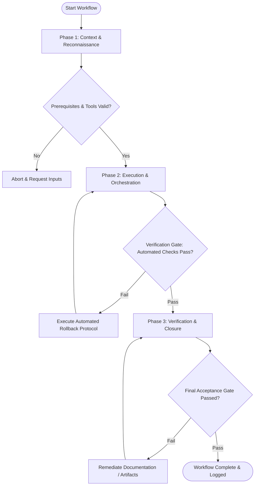

# Workflow: User Testing Script & Methodology Plan

## Overview & Scope
The Test Plan workflow structures user research studies. It defines participant recruiting criteria, task scenario prompts, moderation scripts, and post-session metrics surveys.

## Execution Flowchart

## Required Tool Inputs & Context
- Interactive prototype or feature candidate
- Research goals and target questions
- User persona profiles & recruiting criteria

## Phase 1: Context & Reconnaissance
- Align research objectives with product team key questions.
- Define target participant recruiting criteria (demographics, tech familiarity, usage frequency).
- Select user testing methodology (moderated vs unmoderated usability study).

## Phase 2: Execution & Orchestration
- Draft un-biased, scenario-based user task prompts (e.g. "Find a product under $50 and add it to cart").
- Author moderator script containing introduction, warm-up questions, and probing prompts.
- Prepare post-test survey questionnaire (SUS / Single Ease Question SEQ).

## Phase 3: Verification & Closure
- Conduct pilot test run with an internal colleague to test script timing and prompt clarity.
- Refine task prompts based on pilot feedback.
- Publish finalized User Test Plan artifact.

## Phase Transition Criteria & Deterministic Verification Gates
| Transition | Prerequisites | Verification Command / Gate | Success Criteria |
|---|---|---|---|
| Phase 1 -> Phase 2 | Tool inputs verified & environment ready | `node dist/cli.js doctor` | Doctor health check succeeds with 0 errors |
| Phase 2 -> Phase 3 | Execution steps complete | `node dist/cli.js doctor` | Doctor health check confirms test plan document compliance |
| Phase 3 -> Completion | Verification complete & artifacts signed off | `npm test` | Validation test confirms task script timing parameters |

## Validation Checkpoints & Automated Rollback Protocols
- **Validation Checkpoint 1**: Task scenario prompts authored using goal-oriented, non-leading phrasing.
- **Validation Checkpoint 2**: Pilot test session completes within target 45-minute time window.
- **Automated Rollback Protocol**: Revise task scenario instructions if pilot participant misinterprets prompts.
