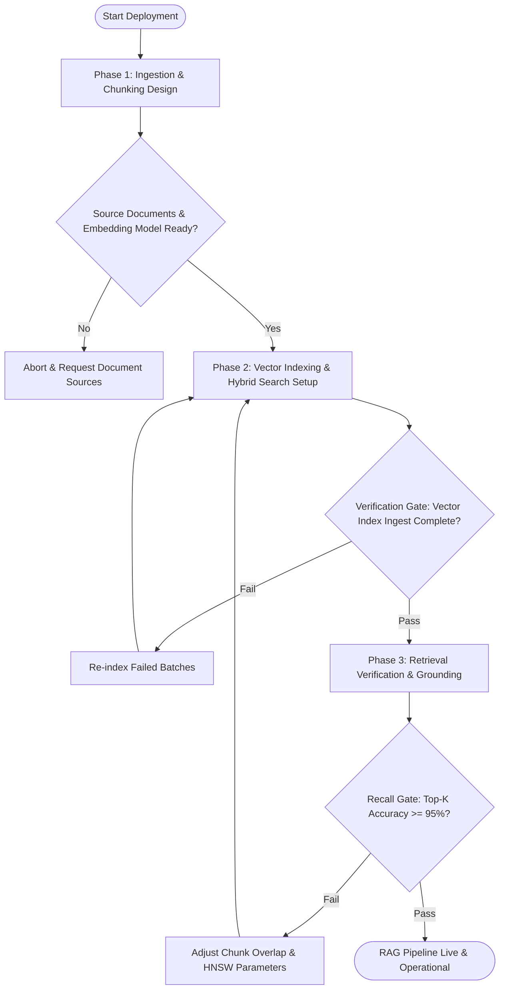

# Workflow: RAG Pipeline Deployment

## Overview & Scope
This workflow coordinates document ingestion, semantic chunking, vector embedding generation, vector collection indexing (Qdrant/Pinecone), and retrieval query endpoint verification.

## Execution Flowchart

## Phase 1: Ingestion & Chunking Design
- Clean and normalize raw documents (Markdown, PDF, HTML).
- Partition documents into semantic chunks with 15% overlap and metadata tagging.

## Phase 2: Vector Indexing & Hybrid Search Setup
- Generate embeddings using target model (OpenAI / BGE / Voyage).
- Bulk upsert vectors into vector database with HNSW payload indexes.
- Configure sparse BM25 index and cross-encoder re-ranking layer.

## Phase 3: Retrieval Verification & Grounding
- Execute validation queries against diverse search intents.
- Verify that retrieved chunks contain source attribution and valid line citations.

## Phase Transition Criteria & Deterministic Verification Gates
| Transition | Prerequisites | Verification Command / Gate | Success Criteria |
|---|---|---|---|
| Phase 1 -> Phase 2 | Chunks prepared | `node dist/cli.js doctor` | Chunking schema verified |
| Phase 2 -> Phase 3 | Ingestion complete | `npm test` | Vector collection stats confirm 100% vectors indexed |
| Phase 3 -> Completion | Retrieval tested | `node dist/cli.js doctor` | Grounding checks pass with zero un-cited assertions |

## Validation Checkpoints & Automated Rollback Protocols
- **Validation Checkpoint 1**: Verify embedding dimensionality matches vector collection config before batch upsert.
- **Validation Checkpoint 2**: Test hybrid search recall against golden QA pairs.
- **Automated Rollback Protocol**: If new vector index corruption occurs during migration, restore previous collection snapshot and redirect search queries to fallback collection.
