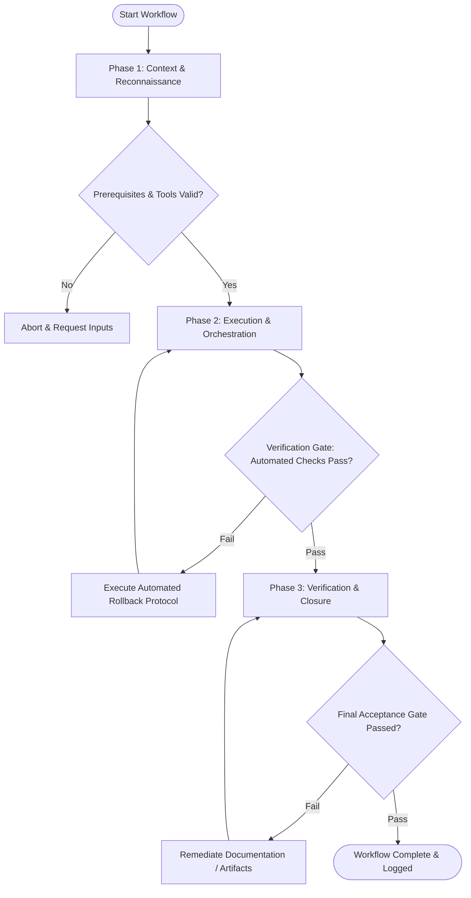

# Workflow: Deep Technical & Domain Research

## Overview & Scope
The Research workflow structures deep technical investigations. It gathers evidence from documentation, academic papers, source codebases, and web resources to synthesize authoritative research reports.

## Execution Flowchart

## Required Tool Inputs & Context
- Research query or problem topic specification
- Web search and documentation lookup tools (`search_web`, `view_file`)
- Research report template

## Phase 1: Context & Reconnaissance
- Define research objectives, core questions, and inclusion/exclusion criteria.
- Identify primary documentation sources, GitHub repositories, and technical standards.
- Formulate initial search queries.

## Phase 2: Execution & Orchestration
- Execute multi-source research gathering technical documentation, code examples, and RFCs.
- Analyze findings for technical feasibility, architectural trade-offs, and performance benchmarks.
- Synthesize raw research notes into structured thematic sections.

## Phase 3: Verification & Closure
- Verify all research claims with direct source citations or codebase line references.
- Formulate actionable recommendations based on research findings.
- Publish Deep Research Synthesis Report.

## Phase Transition Criteria & Deterministic Verification Gates
| Transition | Prerequisites | Verification Command / Gate | Success Criteria |
|---|---|---|---|
| Phase 1 -> Phase 2 | Tool inputs verified & environment ready | `node dist/cli.js doctor` | Doctor health check succeeds with 0 errors |
| Phase 2 -> Phase 3 | Execution steps complete | `node dist/cli.js doctor` | Doctor health check confirms research report document structure |
| Phase 3 -> Completion | Verification complete & artifacts signed off | `npm test` | Report validation test suite confirms citation references |

## Validation Checkpoints & Automated Rollback Protocols
- **Validation Checkpoint 1**: All technical claims supported by primary source documentation or code references.
- **Validation Checkpoint 2**: Synthesis report directly answers all core research questions.
- **Automated Rollback Protocol**: Expand research query scope if initial findings lack sufficient depth or evidence.
