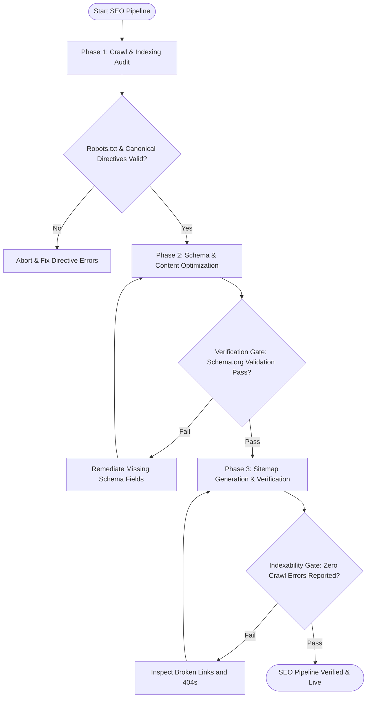

# Workflow: Technical SEO Audit & Programmatic Deployment

## Overview & Scope
This workflow coordinates full-site technical SEO audits, Core Web Vitals checks, schema JSON-LD generation, and programmatic landing page deployments.

## Execution Flowchart

## Phase 1: Crawl & Indexing Audit
- Inspect `robots.txt`, meta robots tags, and canonical headers.
- Audit page load performance and Core Web Vitals scores.

## Phase 2: Schema & Content Optimization
- Inject structured JSON-LD schemas (`SoftwareApplication`, `FAQPage`, `BreadcrumbList`).
- Verify keyword placement in titles, H1/H2 tags, and meta descriptions.

## Phase 3: Sitemap Generation & Verification
- Compile and validate XML sitemaps.
- Submit sitemap ping to search engine consoles.

## Phase Transition Criteria & Deterministic Verification Gates
| Transition | Prerequisites | Verification Command / Gate | Success Criteria |
|---|---|---|---|
| Phase 1 -> Phase 2 | Crawl checks pass | `node dist/cli.js doctor` | 0 robots.txt or canonical errors |
| Phase 2 -> Phase 3 | Schema injected | `npm test` | JSON-LD schema syntax validates cleanly |
| Phase 3 -> Completion | Sitemap verified | `node dist/cli.js doctor` | Sitemaps compiled with valid XML |
