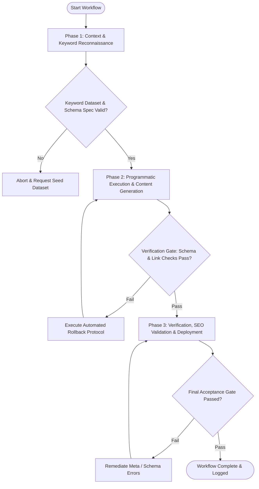

# Workflow: Programmatic SEO & Content Generation Pipeline

## Overview & Scope
The Programmatic SEO & Content Pipeline workflow automates the research, generation, optimization, and technical validation of high-volume programmatic SEO landing pages and editorial content. It orchestrates keyword intent clustering, Schema.org JSON-LD structured data injection, automated internal linking graphs, and static HTML crawl validation.

## Execution Flowchart

## Required Tool Inputs & Context
- Seed keyword dataset & search intent taxonomy (informational, commercial, transactional)
- Target database / programmatic CMS data source (CSV, JSON, SQL records)
- Schema.org structured data templates (Article, FAQPage, BreadcrumbList, Product, Organization)
- Editorial tone and style guide parameters

## Phase 1: Context & Keyword Reconnaissance
- Extract and cluster programmatic search queries based on volume, keyword difficulty, and intent.
- Define URL routing and taxonomy rules (e.g., `/solutions/:use-case-for-:industry`).
- Select and configure Schema.org JSON-LD types matching the target page template.
- Establish internal linking hierarchy between parent hub pages and child programmatic spoke pages.

## Phase 2: Programmatic Execution & Content Generation
- Hydrate content templates dynamically with structured data variables, unique headings, and custom body copy.
- Generate semantic heading structures (H1 through H3) with target keyword integration and natural language density.
- Inject validated Schema.org JSON-LD script blocks into the page header.
- Construct contextual internal links using dynamic anchor text across related programmatic pages.

## Phase 3: Verification, SEO Validation & Deployment
- Execute Schema.org structured data validator against generated pages to guarantee 0 syntax errors or missing required fields.
- Audit page meta tags (title tag <= 60 chars, meta description <= 160 chars, canonical URL, OpenGraph tags).
- Run automated readability scanner (Flesch-Kincaid) and ensure keyword density falls within the 1-2% range.
- Build static pages and generate updated XML sitemap with canonical URL entries.

## Phase Transition Criteria & Deterministic Verification Gates
| Transition | Prerequisites | Verification Command / Gate | Success Criteria |
|---|---|---|---|
| Phase 1 -> Phase 2 | Tool inputs verified & environment ready | `node dist/cli.js doctor` | Doctor health check succeeds with 0 errors |
| Phase 2 -> Phase 3 | Execution steps complete | `npm test` | SEO test suite validates Schema.org JSON-LD syntax and internal link graph integrity |
| Phase 3 -> Completion | Verification complete & artifacts signed off | `npm run build` | Static site generator builds programmatic pages and XML sitemap without errors |

## Validation Checkpoints & Automated Rollback Protocols
- **Validation Checkpoint 1**: 100% of programmatic pages pass Schema.org JSON-LD validation with zero syntax errors or missing required fields.
- **Validation Checkpoint 2**: Internal link graph verification confirms zero broken links and valid canonical tags on every generated page.
- **Validation Checkpoint 3**: Readability and keyword density checks verify content quality without keyword stuffing.
- **Automated Rollback Protocol**: Halt XML sitemap publishing and revert CMS template generation if Schema.org validation fails or duplicate URL canonicalization conflicts are detected.
