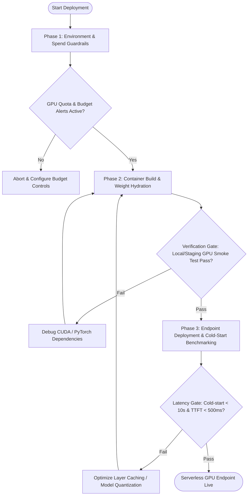

# Workflow: Serverless GPU Deployment

## Overview & Scope
This workflow coordinates packaging model weights, configuring GPU container environments, setting timeout and spend guardrails, and deploying serverless inference endpoints.

## Execution Flowchart

## Phase 1: Environment & Spend Guardrails
- Define maximum execution timeout (`timeout=300s`) and idle scaledown window (`scaledown_window=60s`).
- Verify API credentials and ensure no secrets are hard-coded in source files.

## Phase 2: Container Build & Weight Hydration
- Build container image with pinned CUDA/torch layers.
- Mount network storage volume or pre-bake model weights into layer cache.

## Phase 3: Endpoint Deployment & Cold-Start Benchmarking
- Deploy serverless function to Modal / RunPod / Replicate.
- Run concurrent smoke-test invocations measuring cold-start latency, memory usage, and auto-scaling behavior.

## Phase Transition Criteria & Deterministic Verification Gates
| Transition | Prerequisites | Verification Command / Gate | Success Criteria |
|---|---|---|---|
| Phase 1 -> Phase 2 | Guardrails verified | `node dist/cli.js doctor` | Budget alert and credentials verified |
| Phase 2 -> Phase 3 | Container built | `npm test` | Smoke test inference returns 200 OK |
| Phase 3 -> Completion | Metrics validated | `node dist/cli.js doctor` | Endpoint scales from 0 to N and returns cleanly |

## Validation Checkpoints & Automated Rollback Protocols
- **Validation Checkpoint 1**: Validate timeout parameters and scale-to-zero settings in deployment manifest.
- **Validation Checkpoint 2**: Test health check endpoint under 10 concurrent requests.
- **Automated Rollback Protocol**: If cold-start latency exceeds 30s or error rate exceeds 1%, immediately tear down active endpoint, route traffic to standby API endpoint, and rollback container image tag.
