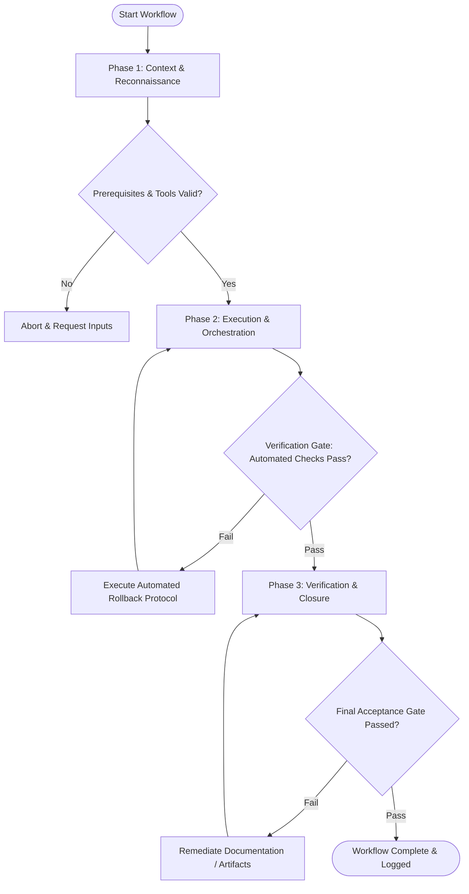

# Workflow: Root Cause Diagnosis & Troubleshooting

## Overview & Scope
The Troubleshoot workflow provides a scientific approach to bug fixing. It guides engineers through reproducing bugs, inspecting stack traces, isolating root causes, applying patches, and adding regression tests.

## Execution Flowchart

## Required Tool Inputs & Context
- Bug report description & error stack trace
- System log files & telemetry data
- Debugger & testing tools

## Phase 1: Context & Reconnaissance
- Analyze error stack trace and log files to isolate failing module and function.
- Construct minimal reproducible test case that reliably triggers the failure.
- Formulate root cause hypotheses based on code inspection.

## Phase 2: Execution & Orchestration
- Validate root cause hypothesis by tracing variable state and execution flow.
- Implement targeted code fix addressing root cause without side effects.
- Verify that minimal reproduction test case transitions from failing to passing.

## Phase 3: Verification & Closure
- Run full project regression test suite to ensure fix introduces zero side effects.
- Document Root Cause Analysis (RCA) report detailing cause, fix, and preventive measures.
- Commit bug fix patch with dedicated regression unit test.

## Phase Transition Criteria & Deterministic Verification Gates
| Transition | Prerequisites | Verification Command / Gate | Success Criteria |
|---|---|---|---|
| Phase 1 -> Phase 2 | Tool inputs verified & environment ready | `node dist/cli.js doctor` | Doctor health check succeeds with 0 errors |
| Phase 2 -> Phase 3 | Execution steps complete | `npm test` | Reproduction test passes cleanly post-fix |
| Phase 3 -> Completion | Verification complete & artifacts signed off | `npm run typecheck` | Type checker confirms patch introduces no type errors |

## Validation Checkpoints & Automated Rollback Protocols
- **Validation Checkpoint 1**: Bug reliably reproduced in isolation before applying fix.
- **Validation Checkpoint 2**: Full regression test suite passes cleanly with zero broken tests.
- **Automated Rollback Protocol**: Revert patch edits using `git checkout` if regression tests reveal unexpected side effects.
