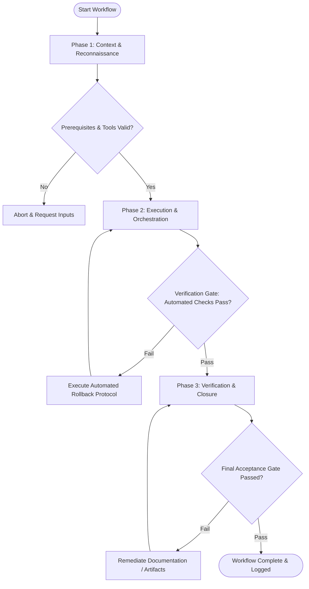

# Workflow: Color System & Palette Design

## Overview & Scope
This workflow defines accessible, scalable color systems. It governs the generation of color scales, semantic token mappings, contrast ratio auditing against WCAG 2.1 AA, and dark mode palette generation.

## Execution Flowchart

## Required Tool Inputs & Context
- Brand style guide and core brand colors
- WCAG 2.1 contrast ratio standards (4.5:1 text, 3:1 UI controls)
- Design token repository file (`tokens.json` / CSS variables)

## Phase 1: Context & Reconnaissance
- Audit existing color usage across UI components and brand guidelines.
- Identify primary, secondary, neutral, and functional feedback colors (success, warning, error, info).
- Set target accessibility contrast ratios for light and dark themes.

## Phase 2: Execution & Orchestration
- Generate 10-step color shade scales (50 through 900) using perceptual color spaces (OKLCH / HSL).
- Map raw color scale values to semantic tokens (`bg-primary`, `text-body`, `border-muted`).
- Construct dark mode color palette variants ensuring consistent contrast ratios.

## Phase 3: Verification & Closure
- Run automated contrast ratio checks on all text/background token combinations.
- Export finalized color tokens to CSS custom properties and JSON token manifests.
- Document color usage guidelines and accessibility compliance matrix.

## Phase Transition Criteria & Deterministic Verification Gates
| Transition | Prerequisites | Verification Command / Gate | Success Criteria |
|---|---|---|---|
| Phase 1 -> Phase 2 | Tool inputs verified & environment ready | `node dist/cli.js doctor` | Doctor health check succeeds with 0 errors |
| Phase 2 -> Phase 3 | Execution steps complete | `npm test` | Automated contrast check suite passes for 100% of color token pairs |
| Phase 3 -> Completion | Verification complete & artifacts signed off | `npm run build` | Token compilation script builds valid CSS/JSON outputs |

## Validation Checkpoints & Automated Rollback Protocols
- **Validation Checkpoint 1**: All text/background combinations satisfy WCAG 2.1 AA >= 4.5:1 contrast requirement.
- **Validation Checkpoint 2**: Light and dark mode token mappings complete and validated.
- **Automated Rollback Protocol**: Adjust color lightness values automatically if contrast validation fails.
