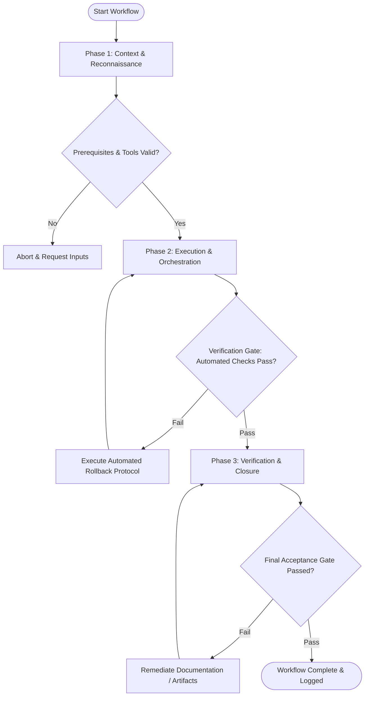

# Workflow: Screen Visual Design & Layout

## Overview & Scope
The Design Screen workflow structures visual UI creation. It guides designers through layout grid setup, visual hierarchy construction, component composition, and responsive screen specs.

## Execution Flowchart

## Required Tool Inputs & Context
- User story & screen wireframe requirements
- Design system component library & token definitions
- Target viewport dimension specifications (Mobile, Tablet, Desktop)

## Phase 1: Context & Reconnaissance
- Review screen user goals, required UI components, and primary user call-to-actions.
- Select layout grid system (4px/8px baseline grid) and viewport container limits.
- Audit required design system components for availability.

## Phase 2: Execution & Orchestration
- Assemble layout framework, placing header, sidebar, main content, and footer containers.
- Populate layout with design system components, applying semantic color and typography tokens.
- Establish visual hierarchy using contrast, spacing, and typographic weight scales.

## Phase 3: Verification & Closure
- Conduct optical alignment check and verify spacing grid adherence across all elements.
- Export screen mockups and redline specs for developer handoff.
- Log new component requirements if custom elements were created during design.

## Phase Transition Criteria & Deterministic Verification Gates
| Transition | Prerequisites | Verification Command / Gate | Success Criteria |
|---|---|---|---|
| Phase 1 -> Phase 2 | Tool inputs verified & environment ready | `node dist/cli.js doctor` | Doctor health check succeeds with 0 errors |
| Phase 2 -> Phase 3 | Execution steps complete | `npm test` | Visual layout test suite confirms 0 grid alignment violations |
| Phase 3 -> Completion | Verification complete & artifacts signed off | `npm run build` | Design assets compile cleanly into build pipeline |

## Validation Checkpoints & Automated Rollback Protocols
- **Validation Checkpoint 1**: Layout adheres strictly to 8px spatial grid system.
- **Validation Checkpoint 2**: 100% of UI components utilized exist in design system library or are flagged as new component specs.
- **Automated Rollback Protocol**: Re-align component layout frames to grid if spatial audit flags alignment errors.
