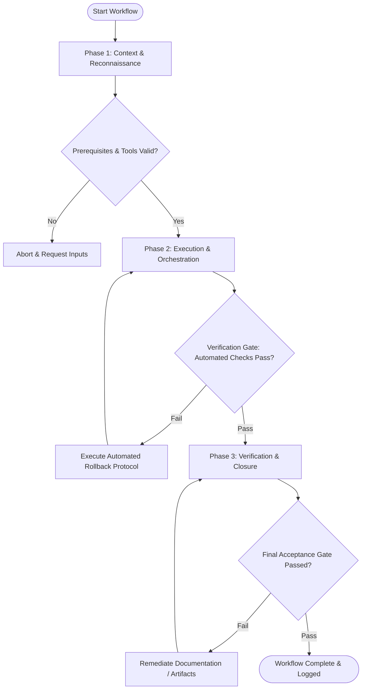

# Workflow: Responsive Breakpoint UI Audit

## Overview & Scope
This workflow systematically audits UI responsiveness across screen sizes. It checks layout reflow, touch target dimensions, font readability, and container query behavior from mobile up to desktop.

## Execution Flowchart

## Required Tool Inputs & Context
- Screen design mockups or live page URLs
- Target viewport breakpoint specs (375px, 768px, 1280px, 1920px)
- Touch target & accessibility standards (>= 44x44px)

## Phase 1: Context & Reconnaissance
- Set up testing viewports for target device dimensions (Mobile Small, Mobile Large, Tablet, Desktop).
- Define breakpoint reflow rules (navigation bar to hamburger menu, multi-column to single-column).
- Prepare responsive inspection checklist.

## Phase 2: Execution & Orchestration
- Inspect layout reflow at each breakpoint for text wrapping, image scaling, and horizontal overflow.
- Verify interactive control dimensions meet minimum 44x44px touch target guidelines on mobile viewports.
- Test container queries and fluid typography scaling across fluid viewport transitions.

## Phase 3: Verification & Closure
- Document visual overflow bugs, layout clipping, or touch target violations.
- Generate responsive remediation ticket list with specific breakpoint fix instructions.
- Publish Responsive Audit Matrix report.

## Phase Transition Criteria & Deterministic Verification Gates
| Transition | Prerequisites | Verification Command / Gate | Success Criteria |
|---|---|---|---|
| Phase 1 -> Phase 2 | Tool inputs verified & environment ready | `node dist/cli.js doctor` | Doctor health check succeeds with 0 errors |
| Phase 2 -> Phase 3 | Execution steps complete | `npm test` | Responsive audit suite confirms 0 horizontal scroll overflow on mobile |
| Phase 3 -> Completion | Verification complete & artifacts signed off | `npm run build` | CSS media queries and breakpoint utility classes compile cleanly |

## Validation Checkpoints & Automated Rollback Protocols
- **Validation Checkpoint 1**: Zero horizontal layout overflow across all tested viewports.
- **Validation Checkpoint 2**: 100% of interactive controls meet minimum touch target size criteria on touch viewports.
- **Automated Rollback Protocol**: Apply responsive container layout patches to fix broken breakpoint reflows.
