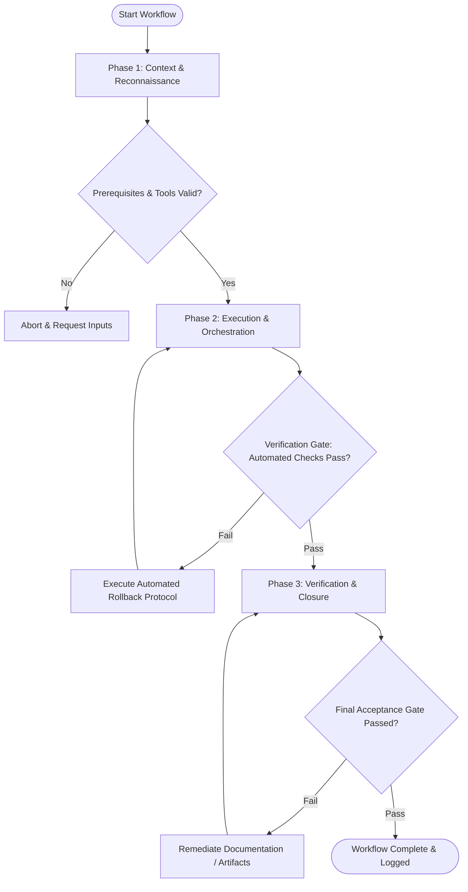

# Workflow: Typography System Specification

## Overview & Scope
The Type System workflow establishes a mathematical typography hierarchy. It defines font stacks, modular scale ratios, line heights, letter spacing, and responsive text utility classes.

## Execution Flowchart

## Required Tool Inputs & Context
- Brand typography guidelines & licensed font files
- Modular scale ratio selection (e.g. Major Third 1.25)
- Target CSS font stack and fallbacks

## Phase 1: Context & Reconnaissance
- Audit existing typographic usage to identify needed scale steps (headings, body, caption, code).
- Select modular scale ratio matching design aesthetic.
- Verify web font formats (WOFF2) and fallback system font stacks.

## Phase 2: Execution & Orchestration
- Calculate font size steps (xs: 12px, sm: 14px, base: 16px, lg: 20px, xl: 25px, 2xl: 31px, etc.).
- Assign relative line-height values (1.2 for headings, 1.5 for body text) to eliminate line collisions.
- Define typography tokens (`font-heading`, `text-body-md`, `font-weight-semibold`).

## Phase 3: Verification & Closure
- Test typography rendering across viewports and browsers for legibility.
- Export typography tokens to CSS variables and Tailwind configuration.
- Publish Typographic Style Spec document.

## Phase Transition Criteria & Deterministic Verification Gates
| Transition | Prerequisites | Verification Command / Gate | Success Criteria |
|---|---|---|---|
| Phase 1 -> Phase 2 | Tool inputs verified & environment ready | `node dist/cli.js doctor` | Doctor health check succeeds with 0 errors |
| Phase 2 -> Phase 3 | Execution steps complete | `npm test` | Typography scale test verifies mathematical consistency of font steps |
| Phase 3 -> Completion | Verification complete & artifacts signed off | `npm run build` | Typography CSS classes compile without syntax errors |

## Validation Checkpoints & Automated Rollback Protocols
- **Validation Checkpoint 1**: All font size steps generated according to selected modular scale ratio.
- **Validation Checkpoint 2**: Every font step includes explicit line-height and letter-spacing specifications.
- **Automated Rollback Protocol**: Recalculate font step sizes if container constraints cause text wrapping defects.
