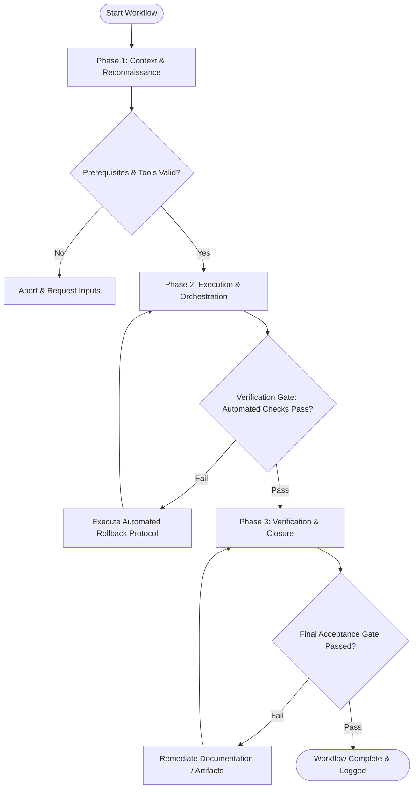

# Workflow: Competitive UX Benchmarking & Heuristic Evaluation

## Overview & Scope
The UX Benchmark workflow provides a structured approach for auditing competitor interfaces. It applies Nielsen-Molich 10 Usability Heuristics to score UX quality and uncover competitive advantages.

## Execution Flowchart

## Required Tool Inputs & Context
- Target competitor product links / screenshots
- Nielsen 10 Usability Heuristics checklist
- UX evaluation scoring template

## Phase 1: Context & Reconnaissance
- Select 3-5 primary competitor products for benchmarking.
- Define core user flows for evaluation (e.g. Onboarding, Search & Filter, Checkout/Conversion).
- Establish scoring criteria (1-5 severity scale for heuristic violations).

## Phase 2: Execution & Orchestration
- Walk through selected user flows on competitor products, taking structured screenshots.
- Score each flow across Nielsen's 10 Heuristics (Visibility of system status, User control, Consistency, Error prevention, etc.).
- Identify UX friction patterns, best practices, and market differentiation opportunities.

## Phase 3: Verification & Closure
- Synthesize audit findings into a Competitive UX Benchmark Matrix.
- Highlight top UX opportunities and design recommendations.
- Publish executive UX Benchmark presentation report.

## Phase Transition Criteria & Deterministic Verification Gates
| Transition | Prerequisites | Verification Command / Gate | Success Criteria |
|---|---|---|---|
| Phase 1 -> Phase 2 | Tool inputs verified & environment ready | `node dist/cli.js doctor` | Doctor health check succeeds with 0 errors |
| Phase 2 -> Phase 3 | Execution steps complete | `node dist/cli.js doctor` | Doctor health check confirms benchmark report artifact structure |
| Phase 3 -> Completion | Verification complete & artifacts signed off | `npm test` | Benchmark score aggregation script runs cleanly |

## Validation Checkpoints & Automated Rollback Protocols
- **Validation Checkpoint 1**: All 10 usability heuristics evaluated for each competitor product flow.
- **Validation Checkpoint 2**: Actionable recommendations backed by documented screenshot evidence.
- **Automated Rollback Protocol**: Re-evaluate benchmark scores if inter-rater discrepancy between evaluators exceeds 1.5 points.
