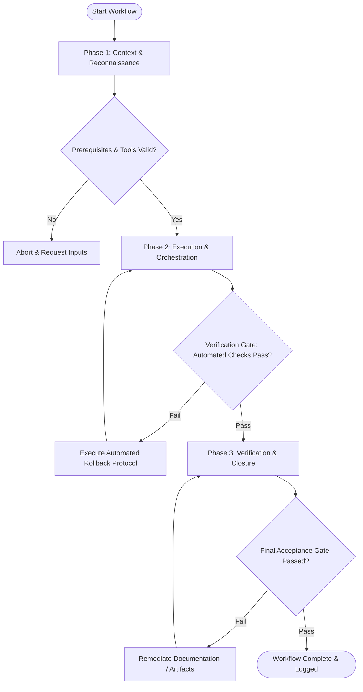

# Workflow: Problem Framing & User Intent Alignment

## Overview & Scope
This workflow aligns product initiatives with genuine user needs. It frames problem statements, constructs Jobs-to-be-Done (JTBD) frameworks, and defines measurable UX success metrics.

## Execution Flowchart

## Required Tool Inputs & Context
- User research data, interview notes, or support ticket trends
- Business goals and strategic objectives
- Problem framing canvas template

## Phase 1: Context & Reconnaissance
- Analyze incoming user feedback, support logs, and analytics data.
- Identify root user pain points vs surface-level feature requests.
- Define target user persona profiles and context of use.

## Phase 2: Execution & Orchestration
- Craft core Problem Statement using standard format: "User [X] needs [Y] because [Z]".
- Develop Jobs-to-be-Done (JTBD) statements: "When [situation], I want to [motivation], so that [outcome]".
- Formulate "How Might We" (HMW) opportunity prompts for solution generation.

## Phase 3: Verification & Closure
- Define quantitative UX success metrics (Task Completion Time, Error Rate, System Usability Scale).
- Validate problem framing canvas with key stakeholders.
- Publish Problem Framing Canvas artifact.

## Phase Transition Criteria & Deterministic Verification Gates
| Transition | Prerequisites | Verification Command / Gate | Success Criteria |
|---|---|---|---|
| Phase 1 -> Phase 2 | Tool inputs verified & environment ready | `node dist/cli.js doctor` | Doctor health check succeeds with 0 errors |
| Phase 2 -> Phase 3 | Execution steps complete | `node dist/cli.js doctor` | Doctor health check confirms problem framing document schema |
| Phase 3 -> Completion | Verification complete & artifacts signed off | `npm test` | Validation test suite confirms presence of metrics and JTBD fields |

## Validation Checkpoints & Automated Rollback Protocols
- **Validation Checkpoint 1**: Problem statement focused on user pain points rather than pre-conceived solution implementations.
- **Validation Checkpoint 2**: Measurable target metrics explicitly defined for problem validation.
- **Automated Rollback Protocol**: Refine problem framing scope if statement is determined to be overly broad or solution-biased.
