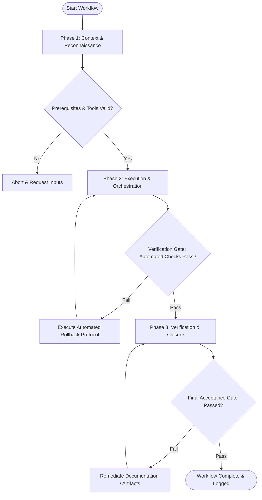

# Workflow: Comprehensive UX Strategy Roadmap

## Overview & Scope
The UX Strategy workflow connects user experience vision with product execution. It maps UX initiatives across strategic horizons (Horizon 1 immediate, Horizon 2 next, Horizon 3 future) and aligns stakeholders.

## Execution Flowchart

## Required Tool Inputs & Context
- Problem framing canvas and competitive benchmark reports
- Business product roadmap and resource constraints
- Technical architecture constraints

## Phase 1: Context & Reconnaissance
- Gather inputs from problem framing, competitive benchmarking, and technical constraints.
- Identify core experience principles that will guide design decisions across all features.
- Audit current user experience debt and friction points.

## Phase 2: Execution & Orchestration
- Map UX initiatives across 3 Strategic Horizons: H1 (Core optimization), H2 (New capabilities), H3 (Transformational experience).
- Construct feature prioritization matrix (Impact vs Effort grid).
- Define experience metrics and key performance indicators (KPIs) for each horizon.

## Phase 3: Verification & Closure
- Validate roadmap feasibility with engineering leads and business leadership.
- Document UX Strategy Roadmap artifact with milestones and dependencies.
- Publish executive UX Strategy Summary.

## Phase Transition Criteria & Deterministic Verification Gates
| Transition | Prerequisites | Verification Command / Gate | Success Criteria |
|---|---|---|---|
| Phase 1 -> Phase 2 | Tool inputs verified & environment ready | `node dist/cli.js doctor` | Doctor health check succeeds with 0 errors |
| Phase 2 -> Phase 3 | Execution steps complete | `node dist/cli.js doctor` | Doctor health check validates UX strategy document structure |
| Phase 3 -> Completion | Verification complete & artifacts signed off | `npm run build` | Build pipeline confirms documentation artifacts compile cleanly |

## Validation Checkpoints & Automated Rollback Protocols
- **Validation Checkpoint 1**: UX strategy aligns directly with documented business goals and user needs.
- **Validation Checkpoint 2**: Technical feasibility verified with engineering leads for Horizon 1 items.
- **Automated Rollback Protocol**: Adjust strategic horizon assignments if technical feasibility checks fail.
